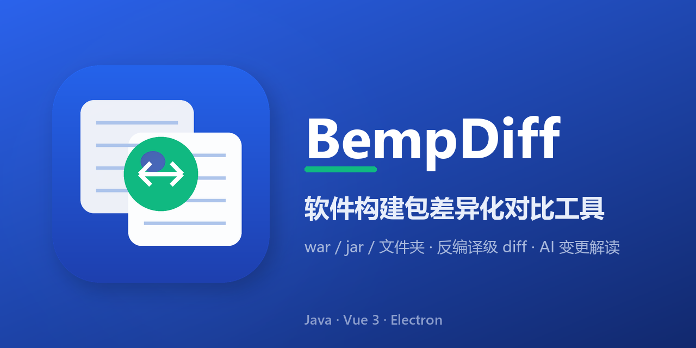

# BempDiff · 差异化对比工具

[](#)

> 软件构建包（war / jar / zip / 文件夹）差异化对比与智能分析桌面工具：丢进老包和新包，自动比对差异、反编译看源码级改动、AI 分析风险与测试要点，导出报告与差异资产。双击安装即用，无需安装 Java。

## 简介

BempDiff 面向「生产版本 vs 下发版本」的发布前比对场景：把两份构建包拖进来，自动逐层解包（支持嵌套 war/jar/zip）、按目录树展示差异、反编译 class 做源码级 diff，并可通过大模型（可自带 API Key）生成整体风险概览与逐文件深度分析。支持 GUI 与 headless 命令行两种用法。

## 特性

- **分层差异**：L0 包级清单 / L1 内部业务码（按内部包前缀展开 class）/ L2 第三方依赖（jar 级折叠），变更一眼分层
- **自动逐层解包**：嵌套 war → jar → zip 递归展开为原子条目，内存/磁盘双轨管理（小文件内存驻留、全局 256MB 软上限）
- **反编译 diff**：CFR 为主、javap 降级；GBK 容错解码；只展示变更行 + 行号区间
- **前端资源对比**：JS / HTML / CSS 文本差异（自动美化后对比）
- **文件夹对比**：直接对比两个解压目录（名称/类型/大小/mtime/SHA-256）
- **BCompare 风格交互**：目录树视图（折叠/全部展开）、路径导航历史（后退/前进/向上一层）、拖拽即比、类型自动识别（文件/目录同一对话框）
- **两阶段 AI 分析**：整体概览 + 单文件深读（Top-K 限流）；成本闸门预估 token 费用；金融合规脱敏；API Key 默认不落盘；AI 不可达时优雅降级
- **多任务 AI 控制台**：并行分析多类别、流式输出、思考过程可折叠、可中止/重启
- **智能分类**：AI 对全部变更文件打标风险等级与变更类别，差异树着色展示
- **项目级上下文增强**：AI 分析前离线扫描指定工程目录（构建系统/模块依赖/技术约定），结论更贴合实际工程
- **导出**：Markdown 报告（只写差异内容）、差异 class 资产 zip、反编译源码包、下载管理（大包异步导出）

## 安装

从 [Releases](../../releases) 下载 `BempDiff-setup.exe`（Windows 10/11 x64，NSIS 安装包，内嵌瘦 JRE，无需装 Java），双击安装即可。

## 快速开始

### GUI（推荐）

1. 启动 BempDiff，浏览或拖入「老包（生产）」与「新包（下发）」路径——文件与目录同一对话框，类型自动识别
2. 点击「开始比对」，等待解包与差异树生成
3. 左侧差异树点选文件 → 中间双栏源码 diff（支持 全量/仅差异、unified/split/wrap 视图）
4. 需要时点 ⚙ 配置中心填 AI 厂商 BaseURL + API Key → 工具栏「智能分析」发起 AI 分析（下方控制台流式输出）
5. 导出菜单：生成报告 / 导出差异资产 / 下载管理

### 命令行 headless（CI / 服务器）

`BempDiff.exe` 带子命令参数时直接跑核心比对并退出，不弹窗口：

```bash
BempDiff.exe compare <old> <new> [--expand-all]
BempDiff.exe report  <old> <new> [--expand-all] [--top-k N] [--cfr cfr.jar] [--report out.md]
BempDiff.exe folderdiff <leftDir> <rightDir> [--report <md>] [--max-depth N]
BempDiff.exe export  <old> <new> [--expand-all] [--top-k N] [--out outdir]
BempDiff.exe diff-jars <old.jar> <new.jar>
BempDiff.exe decompile <old> <new> [--expand-all] [--top-k N] [--cfr cfr.jar]
BempDiff.exe ai <old> <new> [--apikey KEY] [--baseurl URL] [--provider P] [--project <工程目录>]
BempDiff.exe server [--port 18765] [--webroot <dir>]
```

也可直接用 Java 运行核心：`java -cp classes com.bempdiff.Main <子命令> ...`

## 配置

- **对比选项**（⚙ 配置中心）：内部包前缀（L1 展开规则）、Top-K、忽略空白/注释/正则/扩展名、嵌套解包线程数与深度
- **AI**：厂商（OpenAI 兼容/Azure/Ollama 等）、BaseURL、API Key（掩码显示，默认不落盘）、模型、连接测试、代理、成本闸门阈值
- **界面**：主题切换、差异树过滤、启动图

## 开发

技术栈：Electron（壳）+ Vue 3 / Bootstrap / Vite（前端）+ Java 21（核心比对引擎，sidecar 进程）。

```bash
# 前端开发（Vite 热更 + Java 后端 sidecar）
tooling/scripts/启动桌面壳.bat

# 前端构建
cd webui && npm install && npm run build

# 桌面壳安装包（electron-builder → NSIS setup.exe）
cd bempdiff && npm install && npm run dist
```

目录结构：

| 路径 | 说明 |
| --- | --- |
| `java_core/` | Java 核心比对引擎（分层差异 / 解包 / 反编译 / AI 管线 / HTTP 服务） |
| `webui/` | Vue 3 + Bootstrap 前端（Vite 构建，vitest 单测） |
| `dev-shell/` | Electron 壳（sidecar 生命周期 / 原生对话框 / 打包配置） |
| `dist_input/` | 打包落地物（瘦 JRE / 编译产物 / CFR / 前端 dist） |
| `assets/` | logo、图标、GitHub 社交预览图 |
| `scripts/` | 构建/清理等开发期脚本 |
| `docs/` | 设计文档、评审报告、打包手册 |

### 测试

```bash
# 前端单测（vitest，23 个文件 216+ 用例）
cd webui && ./node_modules/.bin/vitest run

# Java 核心（内置轻量 TestRunner）
java -cp "classes;test;lib/*" com.bempdiff.test.TestRunner com.bempdiff.test.DiffTest
```

## 已知限制

- Windows 优先（NSIS 安装包）；其它平台可用 `server` 子命令 + 浏览器访问 Web UI
- AI 功能需自带 API Key；无 Key 时可完整使用比对/反编译/报告，AI 部分走 Mock 降级
- 超大包（数万条目）首次比对耗时与包大小相关，解包阶段有进度提示

## 许可证

内部工具，未附开源许可证（All rights reserved）。
